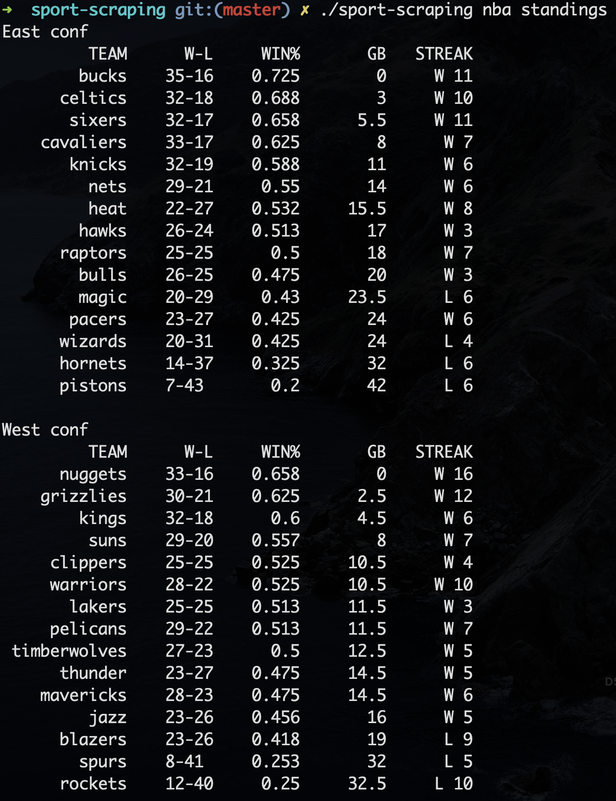
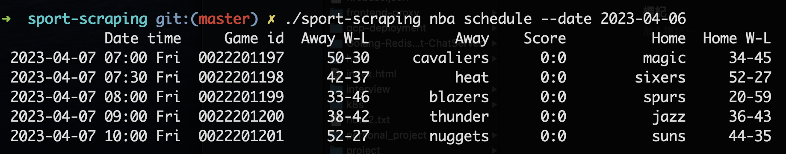
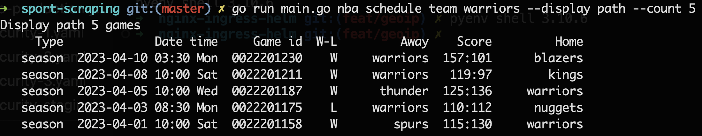

## sport-scraping

This is a command-line application developed using Golang for scraping sports information. Currently, it provides functionality for NBA standings, schedules for indicate dates, past and upcoming schedules for specific teams, and more.

### Build and run with your golang environment
After clone the project.
```
go install
```

```
go build -o sport-scraping main.go
```

Execute it with following commands.
```
./sport-scraping nba [command] [OPTION]
```
<br>
<p align="center">
  
</p>
<br>

#### `standings` command

| Option | Description | Type | Default | Required? |
|--------|----------------------------------------------------------|--------|---------|-----------|
| `--groupby` | groupby parameter: conf or div | `string` | `conf` | No |
| `--season` | season year | `string` | `2022-23` | No |
<br>
<p align="center">
  
</p>
<br>

#### `schedule` command

| Option | Description | Type | Default | Required? |
|--------|----------------------------------------------------------|--------|---------|-----------|
| `--date` | America Game date, ex: 2023-01-01 | `string` | `today` | No |
<br>
<p align="center">
  
</p>
<br>

#### `schedule` `team` command

| Command Arg       | Description                   | Type     |
|-------------------|-------------------------------|----------|
| `[specific team]` | Choice the team, ex. warriors | `string` |

| Option      | Description                           | Type     | Default    | Required? |
|-------------|---------------------------------------|----------|------------| ----------|
| `--count`   | How many games will be displayed      | `int`    | `10`       | No        |
| `--display` | Display the upcoming or path schedule | `string` | `upcoming` | No        |
| `--year`    | Season year                           | `string` | `2022`     | No        |

<br>
<p align="center">
  
</p>
<br>

#### `pbp` command
Show detailed play-by-play information about the game.

| Command Arg | Description                  | Type  |
|-------------|------------------------------|-------|
| `[game id]`  | Get ID from shcedule command | `int` |

| Option        | Description                                                                  | Type   | Default | Required? |
|---------------|------------------------------------------------------------------------------|--------|---------|-----------|
| `--count`     | How many pieces of play-by-play game information will be displayed initially | `int`  | `10`    | No        |
| `--streaming` | Streaming play-by-play information during live broadcasts of games           | `bool` | `5`     | No        |
| `--interval`  | The interval for crawling the result, range is 3 ~ 60 seconds                | `int`  | `2022`  | No        |
<br>
<p align="center">
  
</p>
<br>


### To Be Continued!
