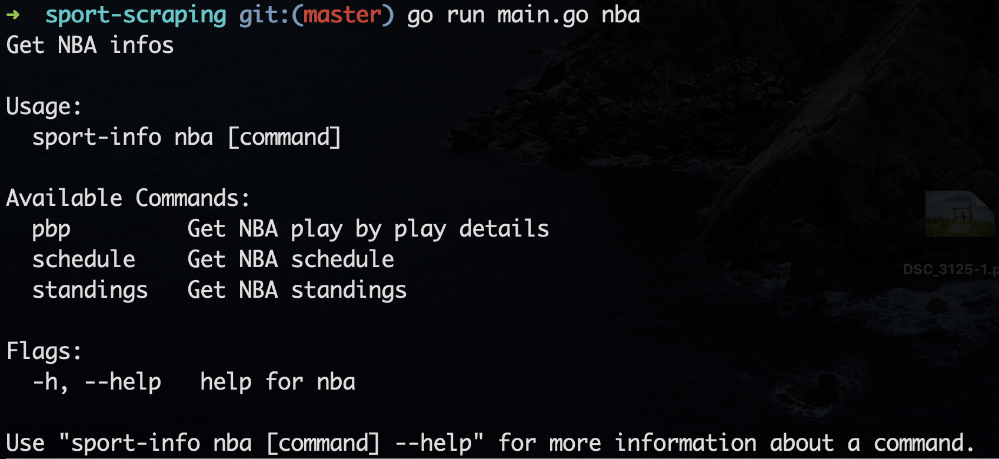

## sport-scraping

This is a command-line application developed using Golang for scraping sports information. Currently, it provides functionality for NBA standings, schedules for indicate dates, past and upcoming schedules for specific teams, and more.

### Build and run with your golang environment
After clone the project.
```
go install
```

```
go build main.go
```

Execute it with following commands.
```
./sport-scraping nba [command] [OPTION]
```
<br>
<p align="center">
  
</p>
<br>

#### `standings` command

| Option | Description | Type | Default | Required? |
|--------|----------------------------------------------------------|--------|---------|-----------|
| `--groupby` | groupby parameter: conf or div | `string` | `conf` | No |
| `--season` | season year | `string` | `2022-23` | No |
<br>
<p align="center">
  
</p>
<br>

#### `schedule` command

| Option | Description | Type | Default | Required? |
|--------|----------------------------------------------------------|--------|---------|-----------|
| `--date` | America Game date, ex: 2023-01-01 | `string` | `today` | No |
<br>
<p align="center">
  
</p>
<br>

### To Be Continued!
